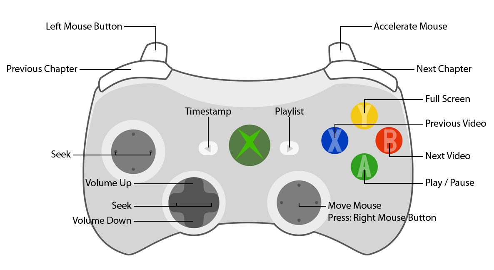

# Xbox 360 Controller mapping for VLC

Uses GlovePIE / PIEFree. [Download v0.45 here](http://glovepie.org/GlovePIE045Free.zip).

Note: this script assumes the default hotkeys are used in VLC.


## Normal use

1. Open the `x360-vlc-mapping.pie` file with GlovePIE.
2. Run the script with `F9`.
3. Open VLC.

Note: VLC needs to be selected (focussed) for the video controls to work.
The mouse controls work anywhere.


## Mapping




## Advanced use

### Automation shortcut

To open and run the script as well as open VLC in one go, create the following windows shortcut.

```
C:\<path-to-GlovePIE>\PIEFree.exe -"C:\<path-to-Repository>\x360-vlc-mapping.pie" /r:"C:\Program Files (x86)\VideoLAN\VLC\vlc.exe"
```

Be sure to replace the paths with the right paths to your files.

#### Nice shortcut icon

1. Go to Devices and Printers in the config panel.
2. Find a device with the Xbox 360 controller icon.
3. Right click it -> `Create Shortcut`.
4. On your desktop right click the new shortcut -> `Properties`.
5. In the `Shortcut` tab, click `Change Icon...`.
6. Copy the location of the icon file. It should be something like `...\appdata\local\...\XBOX360WirelessControllerforWindows.ico`.
7. Close the dialogues and delete the shortcut.
8. Right click the shortcut you want to use for the VLC mapping -> `Properties`.
9. In the `Shortcut` tab, click `Change Icon...`.
10. Paste the icon file location and press `Enter`.
11. Select the icon and press `OK`.
12. Press `OK` again.

### Remove UAC warning

If you're using the shortcut and get tired of the UAC warning, you can use the `uac-whitelist.bat` script to install the UAC exception. This exception may break when you have a different version of FreePIE.

**Warning: this will allow FreePIE (v0.45) to run as administrator without requiring the UAC confirmation. Use at own risk!**